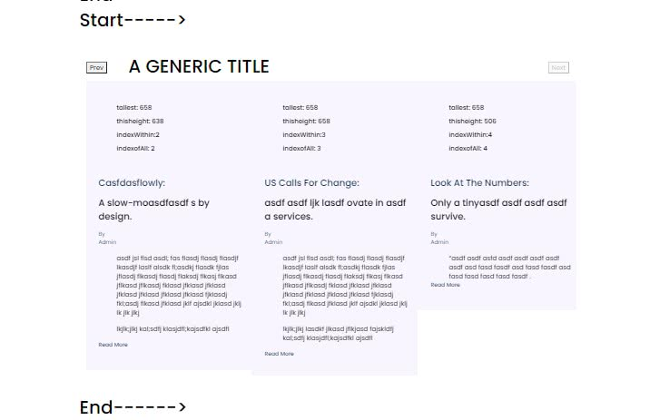

# This is an example of the pure-react-carousel but with a dynamic implementation:

This project is an example of [Pure React Carousel](https://github.com/express-labs/pure-react-carousel).

## This is an example of having different height slides.

Most carousels are made to use standard image sizes.

This example will measure each slide, and default the height of the carousel to that of the largest slide in the group.

It uses a JSON array of objects, but it is not necessary...

It uses refs for each dynamically created slide to measure and set when the page is resized in any way.

It can adjust the number of slides (columns) which are shown.

It is an UGLY example as it was ripped out of a much more complex web site!!!

My use of it is a group of carousels, please contact me if you want a more robust example with multiple sections of each carousel.

